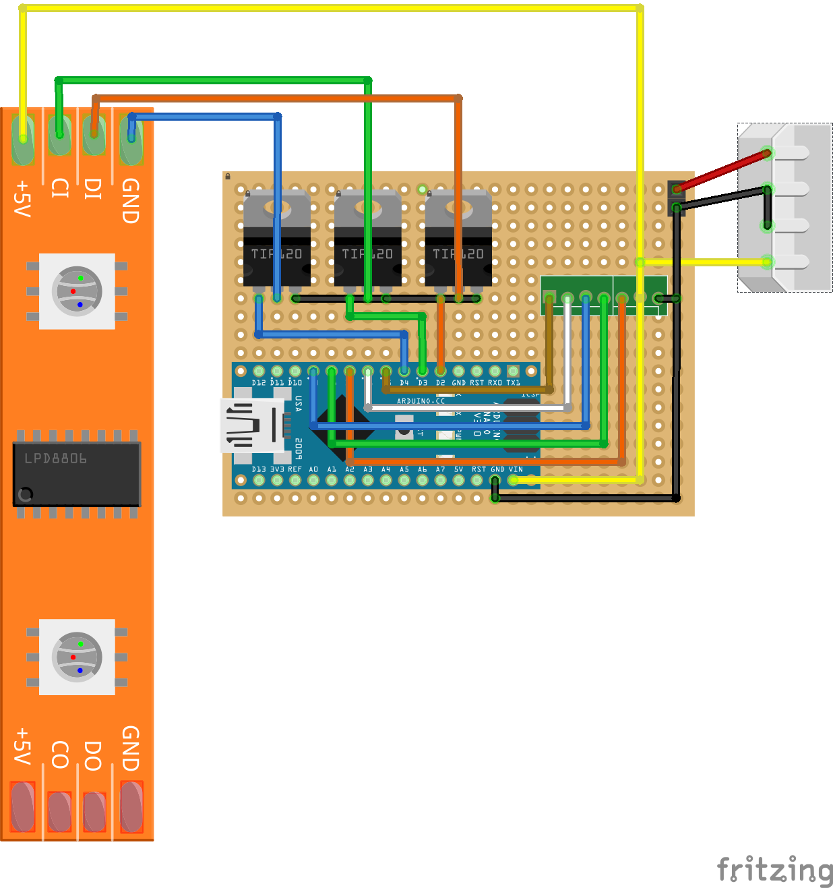

# Tira-de-led-Arduino

El transistor TIP 120, regula el flujo de corriente a su través de 12V y por la tira de LEDs en función de la tensión que pongamos en su base, desde Saturación (Pasa todo) con 5V en la base a corte (No pasa nada) cuando ponemos 0V en la base.

Fuente: [0][prometec]

### Diseño en placa

[prometec]: http://www.prometec.net/tira-de-leds/
